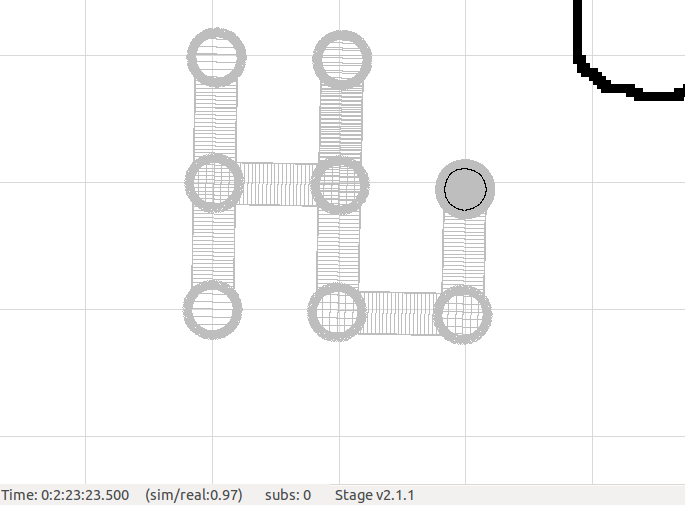

# How To Use

Type the following to get the world open
```
player world.cfg
```

Afterwards, type the following to build our robot and watch them move:
```
./build test-roam && ./test-roam
```
It is also recommended to go to the view tab and enable 'Show trails' so that one can visually see that the robot
has indeed moved in a square.

# Important!
The original build script was altered to include the Robot class. So instead of looking like this:
```
g++ -o $1 `pkg-config --cflags playerc++` $1.cc `pkg-config --libs playerc++`
```
It now looks like this:
```
g++ -o $1 `pkg-config --cflags playerc++` $1.cc Robot.cc `pkg-config --libs playerc++`
```


